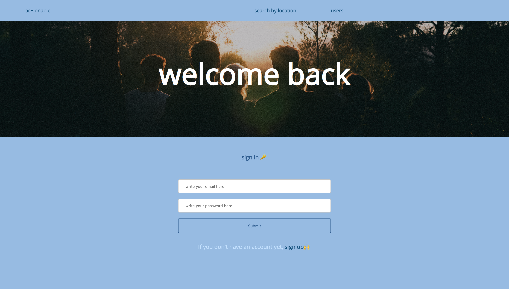
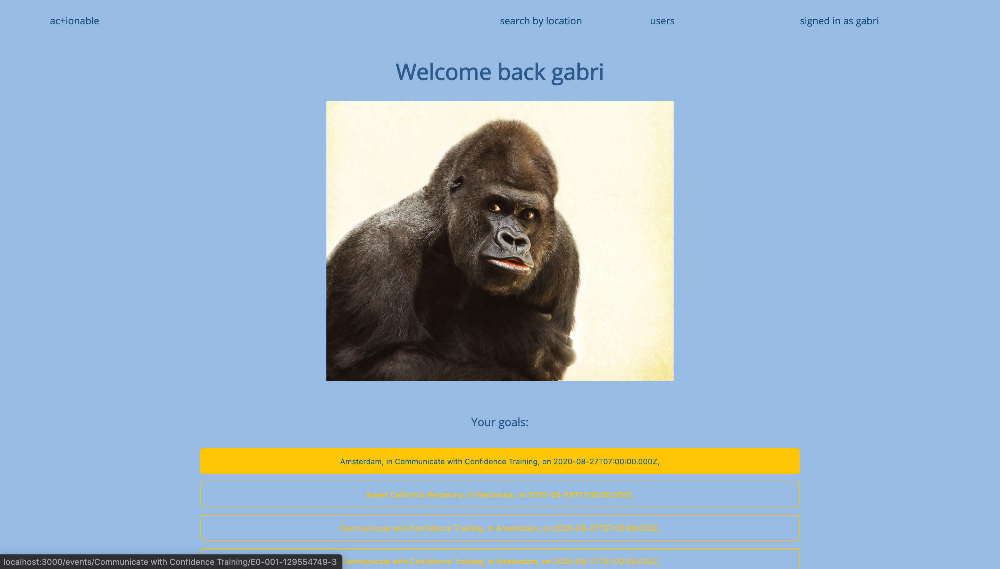

# actionable 🏋️
Actionable lets you take a deeper dive in your personal interests!

#### 🌐 Check the deployed website https://getactionable.herokuapp.com/ and start making your dreams realities 🤩

At actionable any visitor to our website can search, based on location, for events they want to attend 🔍

Any signed up user, they can also add the events they like to their goals 👤

#### Learning in the process 📖💻

This app was developed as my portfolio project after completing the Codaisseur Academy in Amsterdam, the Netherlands 💻

 

The following technologies were used to make it possible CSS | React with Redux | Express | Rest API | SQL | JWT | bcrypt

As any other, this project is not completely finished, but in continous evolution 🧬
